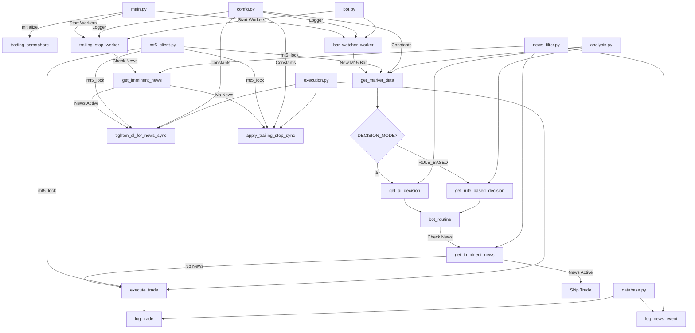

# merQuery-trading-bot

บอทเทรดอัตโนมัติที่ใช้ AI สำหรับเทรดคู่เงิน XAUUSD (ทองคำ) บนแพลตฟอร์ม MetaTrader5 โดยใช้ Timeframe M15

## 📋 ภาพรวมโปรเจกต์

merQuery-trading-bot เป็นบอทเทรดอัตโนมัติที่ใช้ AI ในการวิเคราะห์ตลาดและตัดสินใจเทรด โดยใช้ตัวบ่งชี้ทางเทคนิค (Technical Indicators) ประกอบด้วย RSI, EMA20 และ ATR14 เพื่อช่วยในการตัดสินใจ

### ✨ คุณสมบัติหลัก

- 🤖 **AI-Powered Trading**: ใช้ AI (DeepSeek หรือ GLM) ในการวิเคราะห์และตัดสินใจเทรด
- ⚡ **Rule-Based Mode**: โหมดตัดสินใจแบบ Rule-based ที่เร็วกว่า 100x และไม่มีค่าใช้จ่าย API
- 📊 **Technical Indicators**: ใช้ตัวบ่งชี้ RSI14, EMA20 และ ATR14
- 🔄 **Trailing Stop**: ระบบ Trailing Stop อัตโนมัติที่ใช้ ATR เป็นฐาน
- ⚡ **Async Architecture**: สถาปัตยกรรมแบบ Asynchronous พร้อมการควบคุม Concurrency
- 🔒 **Thread-Safe**: การเรียก API ของ MT5 ที่ปลอดภัยด้วย Thread Lock
- 💾 **SQLite Logging**: บันทึกประวัติการเทรดลงฐานข้อมูล SQLite
- ⚠️ **Risk Management**: ระบบควบคุมความเสี่ยงด้วย Daily Loss Limit
- 📰 **News Filter**: ระบบกรองข่าวเศรษฐกิจที่สำคัญ พร้อม News Blackout และการปรับ SL อัตโนมัติ

## 📦 ความต้องการของระบบ (Prerequisites)

- Python 3.8 ขึ้นไป
- MetaTrader5 Terminal
- บัญชี Demo หรือ Live บน MT5 (แนะนำให้ทดสอบบน Demo ก่อน)
- API Key จาก DeepSeek หรือ GLM

## 🚀 การติดตั้ง

### 1. Clone Repository

```bash
git clone https://github.com/yourusername/merQuery-trading-bot.git
cd merQuery-trading-bot
```

### 2. ติดตั้ง Dependencies

```bash
pip install -r requirements.txt
```

**Dependencies ที่จำเป็น:**
- `MetaTrader5` - API สำหรับเชื่อมต่อกับ MetaTrader5
- `pandas` - สำหรับการจัดการข้อมูล
- `pandas-ta` - Technical Analysis library
- `openai` - OpenAI API client (สำหรับ DeepSeek และ GLM)
- `python-dotenv` - จัดการ environment variables
- `requests` - HTTP client สำหรับดึงข่าวจาก ForexFactory

### 3. ตั้งค่า Environment Variables

คัดลอกไฟล์ `.env.example` เป็น `.env` และกรอกค่า API Keys:

```bash
copy .env.example .env
```

แก้ไขไฟล์ `.env`:

```env
DEEPSEEK_API_KEY=your_deepseek_key_here
GLM_API_KEY=your_glm_key_here

# Decision Mode: "AI" หรือ "RULE_BASED"
# RULE_BASED เร็วกว่า 100x, ประหยัดค่า API, และเสถียรกว่า
DECISION_MODE=AI

# Active AI Provider: "DEEPSEEK" หรือ "GLM" (ใช้เมื่อ DECISION_MODE=AI)
ACTIVE_AI=GLM

MAX_DAILY_LOSS_USD=50.0
MAGIC_NUMBER=100100
TRAILING_MIN_PROFIT_ATR=0.5
TRAILING_DISTANCE_ATR=0.4
BAR_WATCHER_POLL_S=1.0
TRAILING_INTERVAL_S=2.0
```

## ⚙️ การตั้งค่า (Configuration)

### ตัวแปรหลักในไฟล์ `.env`

| ตัวแปร | คำอธิบาย | ค่าเริ่มต้น |
|--------|----------|-------------|
| `DECISION_MODE` | โหมดการตัดสินใจ (AI หรือ RULE_BASED) | AI |
| `ACTIVE_AI` | ระบุ AI ที่จะใช้ (DEEPSEEK หรือ GLM) | GLM |
| `DEEPSEEK_API_KEY` | API Key สำหรับ DeepSeek | - |
| `GLM_API_KEY` | API Key สำหรับ GLM | - |
| `MAX_DAILY_LOSS_USD` | ขีดจำกัดการขาดทุนต่อวัน (USD) | 50.0 |
| `MAGIC_NUMBER` | Magic Number สำหรับระบุออเดอร์ของบอท | 100100 |
| `TRAILING_MIN_PROFIT_ATR` | กำไรขั้นต่ำก่อนเริ่ม Trailing (ATR) | 0.5 |
| `TRAILING_DISTANCE_ATR` | ระยะห่าง Trailing Stop (ATR) | 0.4 |
| `BAR_WATCHER_POLL_S` | ช่วงเวลาตรวจสอบแท่งเทียน (วินาที) | 1.0 |
| `TRAILING_INTERVAL_S` | ช่วงเวลาอัปเดต Trailing Stop (วินาที) | 2.0 |

### โหมดการตัดสินใจ (Decision Mode)

บอทรองรับ 2 โหมดการตัดสินใจ:

#### AI Mode (ค่าเริ่มต้น)
- ใช้ LLM (DeepSeek หรือ GLM) ในการวิเคราะห์ตลาด
- มีค่าใช้จ่าย API
- ใช้เวลา ~1-5 วินาทีต่อการวิเคราะห์
- เหมาะสำหรับการทดลองและการพัฒนา

#### Rule-Based Mode
- ใช้กฎที่กำหนดไว้ล่วงหน้า (RSI + EMA20)
- ไม่มีค่าใช้จ่าย API
- ใช้เวลา < 1 มิลลิวินาที
- เสถียรและน่าเชื่อถือกว่า
- เหมาะสำหรับ Production ที่ใช้เงินจริง

**วิธีเปลี่ยนโหมด:**
```env
# ใช้ AI Mode
DECISION_MODE=AI

# ใช้ Rule-Based Mode (แนะนำสำหรับ Production)
DECISION_MODE=RULE_BASED
```

### การตั้งค่าใน `src/config.py`

```python
SYMBOL = "XAUUSD"        # คู่เงินที่จะเทรด
LOT_SIZE = 0.01          # ขนาดล็อต
MAX_SL_POINTS = 500      # ระยะห่าง Stop Loss สูงสุด (points)
DB_NAME = "trading_bot.db"  # ชื่อฐานข้อมูล
```

### โครงสร้างโปรเจกต์

```
src/
├── __init__.py          # Python package
├── config.py            # Configuration, constants, logging
├── database.py          # Database operations
├── mt5_client.py        # MT5 API wrappers (รวม mt5_lock)
├── analysis.py          # Market data & AI decision
├── execution.py         # Trade execution & trailing stop
├── news_filter.py       # Economic news filtering & blackout
└── bot.py               # Bot routine & workers
main.py                  # Entry point (main_async, semaphore, signal handler)
```

## 🎯 การใช้งาน

### เริ่มต้นบอท

```bash
python main.py
```

### การทำงานของบอท

1. **Bar Watcher**: ตรวจสอบแท่งเทียน M15 ทุก 1 วินาที
2. **เมื่อแท่งเทียนปิด**: บอทจะวิเคราะห์ข้อมูลตลาด
3. **News Blackout Check**: ตรวจสอบว่ามีข่าวเศรษฐกิจสำคัญใกล้จะออกหรือไม่ (30 นาทีก่อน-หลัง)
4. **Decision Making**:
   - **AI Mode**: ส่งข้อมูลตลาดให้ AI วิเคราะห์ (~1-5 วินาที)
   - **Rule-Based Mode**: ใช้กฎ RSI + EMA20 ในการตัดสินใจ (< 1 มิลลิวินาที)
5. **Trade Execution**: ดำเนินการเทรดตามคำสั่ง (ถ้าไม่อยู่ในช่วง News Blackout)
6. **Trailing Stop**: ปรับ Stop Loss อัตโนมัติทุก 2 วินาที
   - ตรวจสอบข่าวและบีบ SL ให้แคบลงเมื่อใกล้ข่าว
   - ดำเนินการ Trailing Stop ปกติ

### การหยุดบอท

กด `Ctrl + C` เพื่อหยุดบอทอย่างปลอดภัย

## 🏗️ สถาปัตยกรรมระบบ



### คอมโพเนนต์หลัก

- **[`src/config.py`](src/config.py)**: จัดการ configuration, constants ทั้งหมด และ logging setup
- **[`src/database.py`](src/database.py)**: ฟังก์ชันจัดการฐานข้อมูล SQLite (trade_logs, news_logs)
- **[`src/mt5_client.py`](src/mt5_client.py)**: MT5 API wrappers และ `mt5_lock` สำหรับ thread-safe operations
- **[`src/analysis.py`](src/analysis.py)**: ดึงข้อมูลตลาด, ตัดสินใจด้วย AI (DeepSeek หรือ GLM), และ Rule-based decision
- **[`src/execution.py`](src/execution.py)**: ดำเนินการเทรด, trailing stop, และ news-aware SL tightening
- **[`src/news_filter.py`](src/news_filter.py)**: ดึงข่าวเศรษฐกิจจาก ForexFactory, ตรวจสอบ News Blackout
- **[`src/bot.py`](src/bot.py)**: Bot routine และ async workers (bar_watcher_worker, trailing_stop_worker)
- **[`main.py`](main.py)**: Entry point ที่จัดการ lifecycle ของบอท

## 📊 ตัวบ่งชี้ทางเทคนิค

### RSI14 (Relative Strength Index)
- ใช้ระบุสภาพ Overbought (>70) และ Oversold (<30)
- สัญญาณซื้อ: RSI ต่ำกว่า 30 และเริ่มเด้งกลับขึ้น
- สัญญาณขาย: RSI สูงกว่า 70 และเริ่มลดลง

### EMA20 (Exponential Moving Average)
- ใช้ระบุแนวโน้มราคา
- ราคาเหนือ EMA20 = แนวโน้มขาขึ้น
- ราคาต่ำกว่า EMA20 = แนวโน้มขาลง

### ATR14 (Average True Range)
- ใช้วัดความผันผวนของตลาด
- ใช้คำนวณระยะ Stop Loss และ Trailing Stop

## 📰 News Filter Feature

บอทมีระบบกรองข่าวเศรษฐกิจเพื่อลดความเสี่ยงในช่วงข่าวสำคัญ

### การทำงานของ News Filter

1. **ดึงข่าวจาก ForexFactory**: ดึงข่าวเศรษฐกิจประจำสัปดาห์จาก ForexFactory API
2. **กรองข่าวสำคัญ**: เฉพาะข่าว USD High Impact เท่านั้น
3. **News Blackout**: หยุดเปิดออเดอร์ใหม่ 30 นาทีก่อนและหลังข่าวออก
4. **Tighten SL**: เมื่อใกล้ข่าว บีบ SL ให้แคบลงจาก 1.5 ATR เหลือ 0.3 ATR เพื่อลดความเสี่ยง
5. **Cache**: เก็บข่าวไว้ใน Cache 4 ชั่วโมง เพื่อลดการเรียก API

### การตั้งค่า News Filter

```python
TARGET_CURRENCY = "USD"           # สกุลเงินที่ต้องการติดตาม
TARGET_IMPACT = "High"            # ระดับความสำคัญของข่าว
BLACKOUT_MINUTES_BEFORE = 30     # นาทีก่อนข่าวออก
BLACKOUT_MINUTES_AFTER = 30      # นาทีหลังข่าวออก
```

### ตัวอย่างการทำงาน

- **สถานการณ์ปกติ**: บอทเปิดออเดอร์ตามสัญญาณ RSI + EMA20
- **ใกล้ข่าว (30 นาที)**: บอทหยุดเปิดออเดอร์ใหม่ และบีบ SL ของออเดอร์ที่เปิดอยู่ให้แคบลง
- **หลังข่าวผ่านไป**: บอทกลับมาเปิดออเดอร์ตามปกติ

## 🎨 กลยุทธ์การเทรด

### เงื่อนไขการเทรด

**สัญญาณ BUY**:
- RSI อยู่ในสภาพ Oversold (<30) และเริ่มเด้งกลับขึ้น
- ราคาเหนือ EMA20 หรือกำลังข้ามขึ้น

**สัญญาณ SELL**:
- RSI อยู่ในสภาพ Overbought (>70) และเริ่มลดลง
- ราคาต่ำกว่า EMA20 หรือกำลังข้ามลง

**HOLD**:
- ไม่มีสัญญาณชัดเจน
- มีออเดอร์เปิดอยู่แล้ว

### การจัดการความเสี่ยง

- **Stop Loss**: คำนวณจาก ATR × 1.5 (สูงสุด 500 points)
- **Take Profit**: Risk:Reward = 1:1.5
- **Trailing Stop**: เริ่มเมื่อกำไร ≥ 0.5 ATR
- **Daily Loss Limit**: หยุดเทรดเมื่อขาดทุนถึงขีดจำกัด
- **News Blackout**: หยุดเปิดออเดอร์ใหม่ 30 นาทีก่อน-หลังข่าว USD High Impact
- **News-Aware SL**: เมื่อใกล้ข่าว บีบ SL ให้แคบลงจาก 1.5 ATR เหลือ 0.3 ATR

## 🔧 การปรับปรุงล่าสุด (Recent Improvements)

บอทได้รับการปรับปรุงเพื่อแก้ไขปัญหาที่พบในการรีวิวโค้ด Production:

### 1. แก้ไข Daily PnL Bug
- **ปัญหา**: ระบบคำนวณ PnL รวมทุก trades ไม่ว่าจะมาจากบอทนี้หรือไม่
- **วิธีแก้**: เพิ่มการกรองด้วย `MAGIC_NUMBER` และ `comment` เพื่อนับเฉพาะ trades ของบอทนี้
- **ผลกระทบ**: ป้องกันบอทหยุดทำงานผิดพลาดเมื่อมีบอทอื่นหรือเทรดมือรวมอยู่

### 2. แก้ไข Concurrency Bottleneck
- **ปัญหา**: AI API call อยู่ใต้ semaphore ทำให้ trailing stop ถูก block ระหว่างรอ AI
- **วิธีแก้**: ย้าย AI call ออกจาก semaphore ให้ trailing stop ทำงานได้ตลอด
- **ผลกระทบ**: ไม่เสียโอกาส lock profit ระหว่างรอ AI ตอบกลับ

### 3. เพิ่ม Hysteresis สำหรับ Trailing Stop
- **ปัญหา**: Hysteresis เล็กเกินไป (0.005 USD) ทำให้ spam broker
- **วิธีแก้**: เพิ่มเป็น 10 pips (0.10 USD สำหรับ XAUUSD)
- **ผลกระทบ**: ลดจำนวน Modify SL requests ลงอย่างมาก ปลอดภัยจากการโดนแบน

### 4. ปรับปรุง AI Parser
- **ปัญหา**: ใช้ simple replace ง่ายๆ พังเมื่อ AI ตอบผิด format
- **วิธีแก้**: ใช้ regex พร้อม fallback mechanism ที่ robust กว่า
- **ผลกระทบ**: รองรับ AI response ที่หลากหลาย format มากขึ้น

### 5. เพิ่ม Rule-Based Decision Mode
- **ปัญหา**: AI mode ช้าและมีค่าใช้จ่าย API
- **วิธีแก้**: เพิ่ม Rule-based mode ที่เร็วกว่า 100x และไม่มีค่าใช้จ่าย
- **ผลกระทบ**: มีตัวเลือกที่เหมาะสำหรับ Production ที่ใช้เงินจริง

### 6. เพิ่ม News Filter Feature
- **ปัญหา**: บอทเปิดออเดอร์ในช่วงข่าวสำคัญ เสี่ยงต่อการขาดทุนจาก volatility
- **วิธีแก้**: เพิ่มระบบดึงข่าวจาก ForexFactory, News Blackout, และการบีบ SL อัตโนมัติ
- **ผลกระทบ**: ลดความเสี่ยงในช่วงข่าวสำคัญ, บันทึกข่าวลงฐานข้อมูล

## 📝 การบันทึกข้อมูล (Logging)

บอทจะบันทึกข้อมูลลงไฟล์ `bot.log` และฐานข้อมูล `trading_bot.db`

### โครงสร้างฐานข้อมูล

**trade_logs table**:
```sql
CREATE TABLE trade_logs (
    id INTEGER PRIMARY KEY AUTOINCREMENT,
    timestamp DATETIME,
    symbol TEXT,
    action TEXT,
    price REAL,
    sl REAL,
    tp REAL,
    ai_reason TEXT
)
```

**news_logs table**:
```sql
CREATE TABLE news_logs (
    id INTEGER PRIMARY KEY AUTOINCREMENT,
    news_time DATETIME,
    currency TEXT,
    impact TEXT,
    title TEXT,
    UNIQUE(news_time, title)
)
```

## ⚠️ คำเตือนสำคัญ

- ⚠️ **ทดสอบบนบัญชี Demo ก่อน**: อย่าเทรดด้วยเงินจริงโดยไม่ได้ทดสอบก่อน
- ⚠️ **ความเสี่ยงในการเทรด**: การเทรดมีความเสี่ยงสูง อาจสูญเสียเงินทุนได้ทั้งหมด
- ⚠️ **ไม่รับประกันผลกำไร**: บอทนี้ไม่รับประกันว่าจะทำกำไรได้
- ⚠️ **ตรวจสอบ MT5 Build**: ยืนยันรูปแบบ API ของ MT5 กับโบรกเกอร์ของคุณ
- ⚠️ **ติดตามบอท**: ควรติดตามการทำงานของบอทอย่างสม่ำเสมอ

## 🛠️ การแก้ปัญหา (Troubleshooting)

### MT5 ไม่เชื่อมต่อ
- ตรวจสอบว่า MT5 Terminal ทำงานอยู่
- ตรวจสอบการเชื่อมต่ออินเทอร์เน็ต
- ลองรีสตาร์ท MT5 Terminal

### AI API ผิดพลาด
- ตรวจสอบ API Key ในไฟล์ `.env`
- ตรวจสอบว่า API Key ยังใช้งานได้
- ตรวจสอบการเชื่อมต่ออินเทอร์เน็ต

### ไม่มีการเทรด
- ตรวจสอบว่ามีเงินทุนเพียงพอ
- ตรวจสอบว่าไม่มีออเดอร์เปิดอยู่
- ตรวจสอบ Daily Loss Limit
- ตรวจสอบ Log ใน `bot.log`

## 📄 License

โปรเจกต์นี้ใช้ License ตามที่ระบุในไฟล์ [LICENSE](LICENSE)

## 🤝 การมีส่วนร่วม (Contributing)

การมีส่วนร่วมและข้อเสนอแนะเป็นที่ยินดี โปรดสร้าง Pull Request หรือ Issue

## 🚀 แผนพัฒนาในอนาคต (Future Roadmap)

สำหรับฟีเจอร์ที่วางแผนไว้ในอนาคต ดูได้ที่ [`Feature_TODO.md`](Feature_TODO.md) ซึ่งประกอบด้วย:
- รันหลายคู่เงิน (Multi-symbol) ด้วยกลยุทธ์ที่ต่างกัน
- มีระบบจัดการ Risk แบบ Portfolio-level ไม่ใช่แค่ Daily Loss ของคู่เดียว
- มีการเรียกใช้ AI หลายๆ โมเดลมาทำ Ensemble (โหวตตัดสินใจร่วมกัน)

## 📧 ติดต่อ

หากมีข้อสงสัยหรือต้องการติดต่อ สามารถสร้าง Issue ใน Repository ได้

---

**ข้อควรจำ**: การเทรดมีความเสี่ยง ควรศึกษาและทำความเข้าใจก่อนลงทุน
